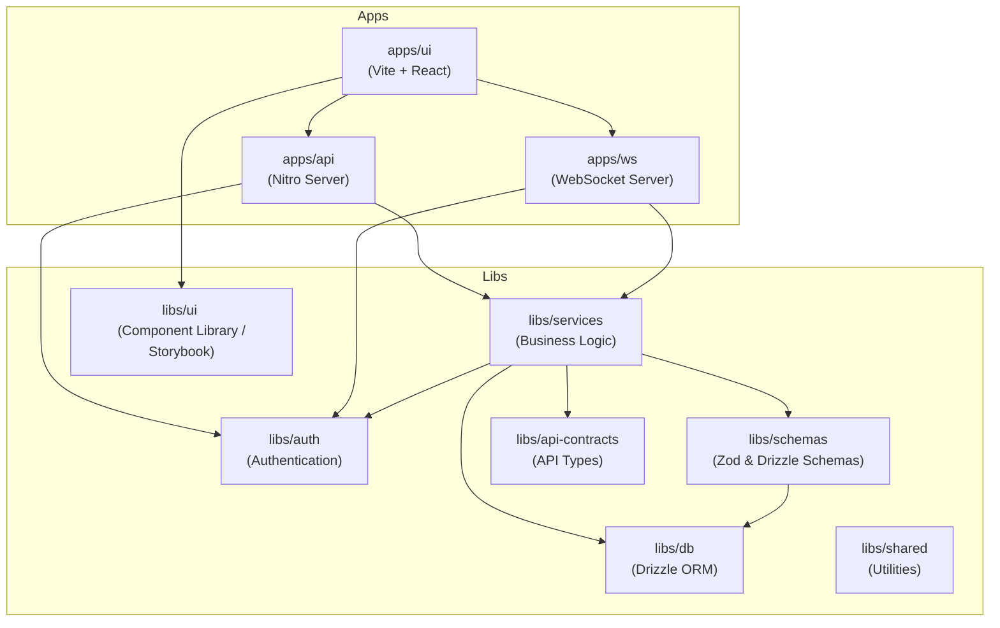

# Agent Monorepo

This repository is a monorepo structured using **Turborepo** (implied by structure) or standard NPM workspaces. It organizes code into **Apps** (deployable applications) and **Libs** (shared libraries).

## Architecture

The following diagram illustrates the dependency relationship between the various components in this repository.

## Components

### Apps (Deployable)

| App | Path | Description |
| :--- | :--- | :--- |
| **@repo/api** | `apps/api` | The backend API server built with **Nitro**. It handles RESTful requests and orchestration. |
| **@repo/ui** | `apps/ui` | The main frontend application built with **React** and **Vite**. It consumes `@repo/api` and uses `@repo/ui-lib`. |
| **@repo/ws** | `apps/ws` | A specialized **WebSocket** server for real-time capabilities. |

### Libs (Shared)

| Lib | Path | Description |
| :--- | :--- | :--- |
| **@repo/services** | `libs/services` | Contains core business logic and service layer, orchestrating DB and Auth. |
| **@repo/auth** | `libs/auth` | Authentication logic and utilities. |
| **@repo/db** | `libs/db` | Database connection, configuration, and migrations using **Drizzle ORM** (Postgres). |
| **@repo/schemas** | `libs/schemas` | Data definitions using **Zod** and Drizzle schemas. |
| **@repo/ui-lib** | `libs/ui` | Shared React component library, developed and tested with **Storybook**. |
| **@repo/api-contracts**| `libs/api-contracts` | TypeScript definitions and Zod schemas used to define the API surface area. |
| **@repo/shared** | `libs/shared` | General purpose utilities used across the repository. |

## Getting Started

1.  **Install Dependencies**: `npm install`
2.  **Run Development**: Use the root scripts (managed by Turbo or similar) to start dev servers.
    *   `npm run dev` (typical)
